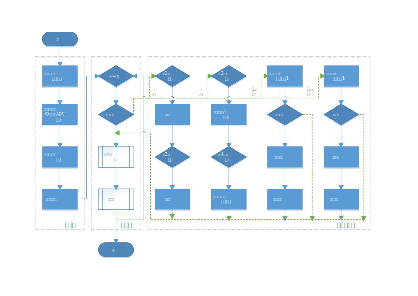
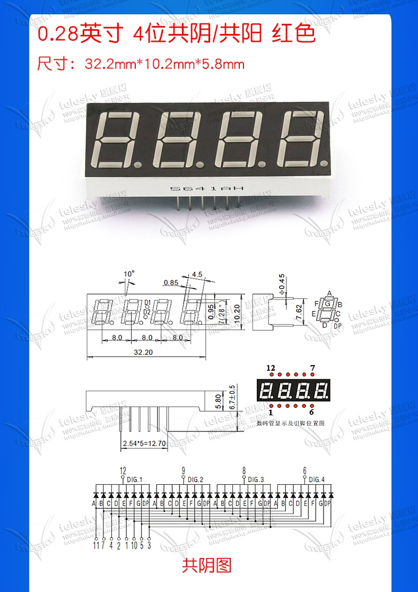

# 智能风扇

## 流程图 



## 文件树

```project
📦include
 ┣ 📜eink_driver.h
 ┣ 📜eink_fonts_imgs.h
 ┣ 📜i2c.h
 ┣ 📜intg_fan.h
 ┣ 📜nixie_driver.h
 ┣ 📜tmp421.h
 ┗ 📜type.h
📦src
 ┣ 📜eink_driver.c
 ┣ 📜eink_fonts_imgs.c
 ┣ 📜i2c.c
 ┣ 📜intg_fan.c
 ┣ 📜nixie_driver.c
 ┗ 📜tmp421.c
📦test
 ┗ 📜main.c
```

## 片上资源

## 外设

### LED数码管

#### 硬件电路



#### 译码表

|      |  DP  |  A   |  B   |  C   |  D   |  E   |  F   |  G   |  (DEX)  |
| :--: | :--: | :--: | :--: | :--: | :--: | :--: | :--: | :--: |  :--:   |
|  0   |  0   |  1   |  1   |  1   |  1   |  1   |  1   |  0   |  0x7E   |
|  1   |  0   |  0   |  1   |  1   |  0   |  0   |  0   |  0   |  0x30   |
|  2   |  0   |  1   |  1   |  0   |  1   |  1   |  0   |  1   |  0x6D   |
|  3   |  0   |  1   |  1   |  1   |  1   |  0   |  0   |  1   |  0x79   |
|  4   |  0   |  0   |  1   |  1   |  0   |  0   |  1   |  1   |  0x33   |
|  5   |  0   |  1   |  0   |  1   |  1   |  0   |  1   |  1   |  0x5D   |
|  6   |  0   |  1   |  0   |  1   |  1   |  1   |  1   |  1   |  0x5F   |
|  7   |  0   |  1   |  1   |  1   |  0   |  0   |  0   |  0   |  0x70   |
|  8   |  0   |  1   |  1   |  1   |  1   |  1   |  1   |  1   |  0x7F   |
|  9   |  0   |  1   |  1   |  1   |  1   |  0   |  1   |  1   |  0x7B   |

#### 接线

| 管脚 | GPIO |
| :--: | :--: |
|  1   | P8.1 |
|  2   | P7.4 |
|  3   | P6.4 |
|  4   | P7.0 |
|  5   | P4.0 |
|  6   | P6.3 |
|  7   | P6.6 |
|  8   | P6.2 |
|  9   | P6.1 |
|  10  | P8.2 |
|  11  | P6.5 |
|  12  | P6.0 |


### 电子墨水屏

### H桥驱动电路

### 电流传感器

### 温度传感器
