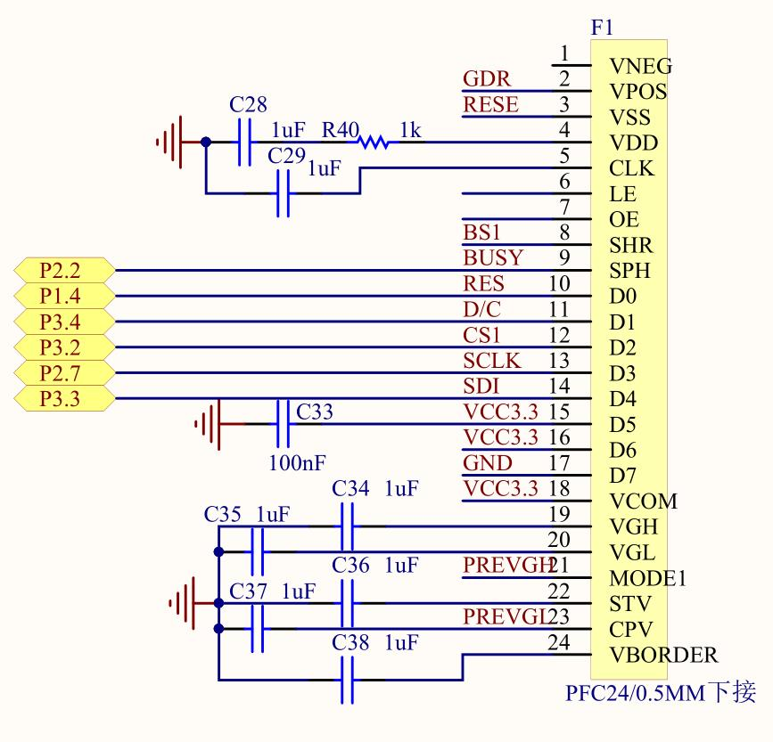
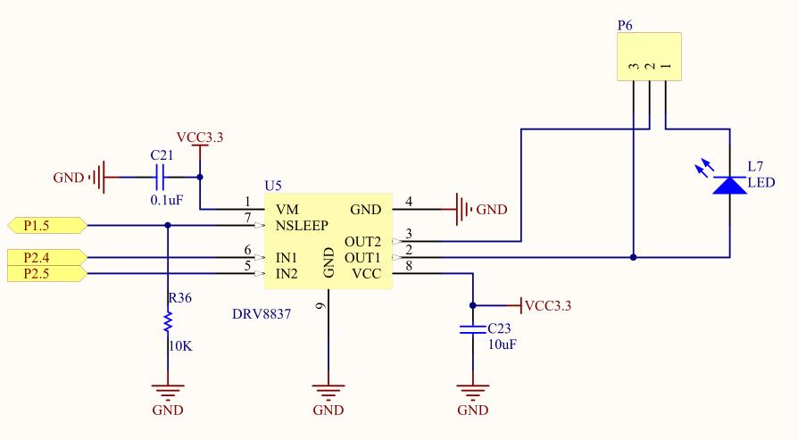
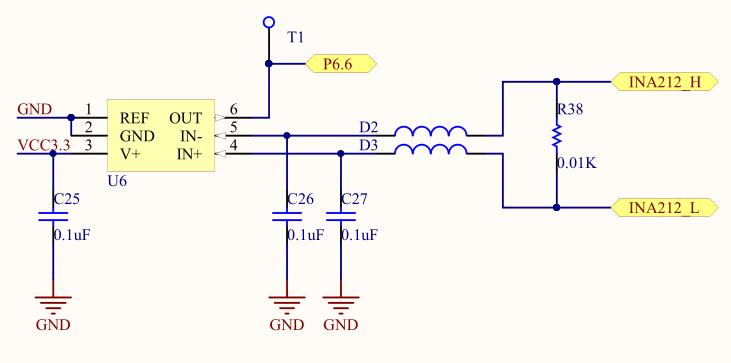
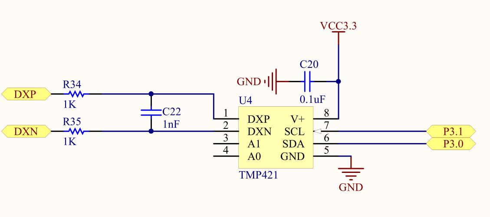

# 智能风扇

## 流程图 


## 文件树

```project
📦include
 ┣ 📜eink_driver.h
 ┣ 📜eink_fonts_imgs.h
 ┣ 📜i2c.h
 ┣ 📜intg_fan.h
 ┣ 📜nixie_driver.h
 ┣ 📜tmp421.h
 ┗ 📜type.h
📦src
 ┣ 📜eink_driver.c
 ┣ 📜eink_fonts_imgs.c
 ┣ 📜i2c.c
 ┣ 📜intg_fan.c
 ┣ 📜nixie_driver.c
 ┗ 📜tmp421.c
📦test
 ┗ 📜main.c
```

## 片上资源

### GPIO

|      |   P1    |   P2    |   P3   |   P4    |  P5  |      P6      |      P7      |      P8      |
| :--: | :-----: | :-----: | :----: | :-----: | :--: | :----------: | :----------: | :----------: |
|  .0  |         |         | TMP421 | NIXIE-5 |      |   NIXIE-12   |   NIXIE-4    |              |
|  .1  |         |         | TMP421 |         |      |   NIXIE-9    |              | LED1/NIXIE-1 |
|  .2  |   S1    |  E-INK  | E-INK  |         |      |   NIXIE-8    |              |   NIXIE-10   |
|  .3  |   S2    |   S3    | E-INK  | NIXIE-7 |      | LED4/NIXIE-6 |              |              |
|  .4  |  E-INK  | DRV8837 | E-INK  |         |      | LED5/NIXIE-3 | LED3/NIXIE-2 |              |
|  .5  | DRV8837 | DRV8837 |  LED6  |         |      |   NIXIE-11   |              |              |
|  .6  |         |   S4    |        |         |      |    INA212    |              |              |
|  .7  |         |  E-ink  |  LED2  |         |      |              |              |              |

## 外设

### LED数码管

#### 硬件电路


#### 译码表

|      |  DP  |  A   |  B   |  C   |  D   |  E   |  F   |  G   | (DEX) |
| :--: | :--: | :--: | :--: | :--: | :--: | :--: | :--: | :--: | :---: |
|  0   |  0   |  1   |  1   |  1   |  1   |  1   |  1   |  0   | 0x7E  |
|  1   |  0   |  0   |  1   |  1   |  0   |  0   |  0   |  0   | 0x30  |
|  2   |  0   |  1   |  1   |  0   |  1   |  1   |  0   |  1   | 0x6D  |
|  3   |  0   |  1   |  1   |  1   |  1   |  0   |  0   |  1   | 0x79  |
|  4   |  0   |  0   |  1   |  1   |  0   |  0   |  1   |  1   | 0x33  |
|  5   |  0   |  1   |  0   |  1   |  1   |  0   |  1   |  1   | 0x5B  |
|  6   |  0   |  1   |  0   |  1   |  1   |  1   |  1   |  1   | 0x5F  |
|  7   |  0   |  1   |  1   |  1   |  0   |  0   |  0   |  0   | 0x70  |
|  8   |  0   |  1   |  1   |  1   |  1   |  1   |  1   |  1   | 0x7F  |
|  9   |  0   |  1   |  1   |  1   |  1   |  0   |  1   |  1   | 0x7B  |

#### 接线

| 管脚 | GPIO |
| :--: | :--: |
|  1   | P8.1 |
|  2   | P7.4 |
|  3   | P6.4 |
|  4   | P7.0 |
|  5   | P4.0 |
|  6   | P6.3 |
|  7   | P4.3 |
|  8   | P6.2 |
|  9   | P6.1 |
|  10  | P8.2 |
|  11  | P6.5 |
|  12  | P6.0 |

### 电子墨水屏

#### 硬件电路



### H桥驱动电路

#### 硬件电路



### 电流传感器

#### 硬件电路



### 温度传感器

#### 硬件电路

